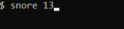
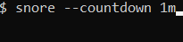
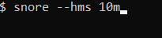
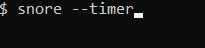

# snore

A small C program that works like `sleep` but prints 1 dot a second, a space
after each 10 seconds, and a newline after every minute.

Go to releases to download 32-bit Windows and Linux executables (made with `zig cc`).

You need to pass in one or more time arguments, an integer, up to 9 digits
long, with optional suffix `s`, `m` or `h` (to mean seconds, minutes or
hours respectively), but unlike with GNU's `sleep` you **cannot use fractionals**.

The given arguments are summed together so passing `1h` `15m` and `30s` will
result in a total of `4530` seconds of sleep (`3600` from `1h`, `900` from
`15m` and `30` from `30s`).

You can also pass `--countdown` to replace the printed dots with a countdown
of seconds, or `--hms` to replace the printed dots with a clock-like countdown
in the format `HH:MM:SS`.

Also, if the terminal is a TTY (as checked by `isatty` function) then after
each print with above two options (but not with the default dots) the clear
ANSI sequence is sent, so while running in a TTY the program keeps changing
the single line instead of printing more lines with new values.

Option `--help` (and `-h`, `-?` and `/?`) will print the help, `--sum` will
only sum the times and error check but not do any countdown, `--nosleep` will
print all the output without any sleeping, and `--print` will print times to
`stderr` as they're being parsed. Some of these options are just to help
me in debugging and development.

Option `--timer` will cause the command not to sleep for any given amount of
time but to count up seconds elapsed, also using `HH:MM:SS` format. If that
option is used, it has to be the only option used.

